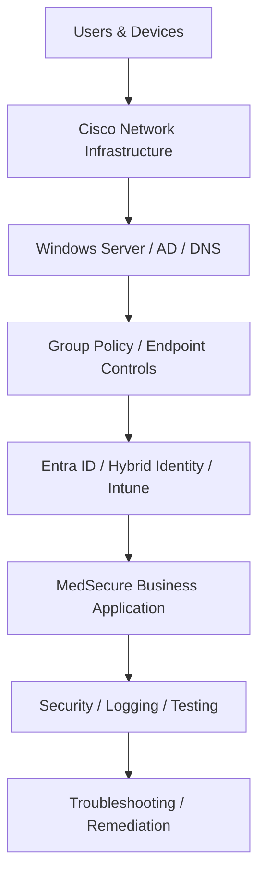

# 09 — Architecture

This section explains how the individual labs fit together conceptually as one enterprise environment.

The specialist labs are not presented as if they all run inside one literal subnet. They are connected at the portfolio and architecture level to demonstrate the responsibilities an infrastructure team supports across networking, identity, endpoints and applications.

## Deep-dive repositories

- Network infrastructure: https://github.com/samirmraut72-bit/Network-Administrator.
- Windows / identity / Intune / MedSecure: https://github.com/samirmraut72-bit/Junior-Systems-Administrator-Windows-Server-AD-Entra-ID-Intune-Lab
