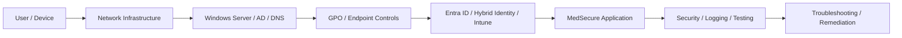

# MedSecure Enterprise Infrastructure Lab

An end-to-end portfolio project showing how the main technology layers of a modern organisation can work together: **networking, Windows Server, Active Directory, Group Policy, hybrid identity, Microsoft Entra ID, Intune, user lifecycle, security, troubleshooting and the MedSecure business application**.

> **Portfolio note:** This is an educational lab using synthetic users, devices and clinical data. The specialist repositories remain available as deeper technical evidence; this repository is the connected, business-level view.

## Why I built this

I did not want to treat networking, systems administration, cloud identity and applications as unrelated subjects. I wanted to follow the same journey an IT team would support inside an organisation: connect the site, create users, manage devices and policy, control access, deliver an application, troubleshoot failures, secure the environment and eventually remove access when a person leaves.

## End-to-end flow

## Business lifecycle demonstrated

**New employee joins** → account and group membership → domain access → GPO → hybrid/cloud identity → Intune-managed endpoint → application role → MedSecure access → security logging.

**Employee leaves** → disable identity → revoke access → remove groups/application roles → recover or reset managed device → verify access removal → document completion.

The onboarding/offboarding section is being expanded as a dedicated lifecycle workflow. Existing screenshots prove the identity, policy, endpoint and application pieces, but I do not present offboarding as completed evidence until it is tested end-to-end.

## Repository map

| Area | What it demonstrates |
|---|---|
| [01-Network-Infrastructure](01-Network-Infrastructure/) | HQ-to-branch enterprise networking, VLANs, OSPF, HSRP, DHCP, trunks and Layer-2 security |
| [02-Windows-Server-Active-Directory](02-Windows-Server-Active-Directory/) | AD DS, users, OUs, DNS and centralised Windows administration |
| [03-GPO-and-Endpoint-Management](03-GPO-and-Endpoint-Management/) | Group Policy and endpoint restrictions/configuration |
| [04-User-Onboarding-Offboarding](04-User-Onboarding-Offboarding/) | Joiner/mover/leaver lifecycle design and evidence plan |
| [05-Hybrid-Identity-Entra-Intune](05-Hybrid-Identity-Entra-Intune/) | Entra Connect, hybrid join, MFA, app roles and Intune |
| [06-MedSecure-Application](06-MedSecure-Application/) | Workforce SSO, MFA, RBAC and the business application |
| [07-Security-and-Hardening](07-Security-and-Hardening/) | Least privilege, segmentation, application security and future attack/defend testing |
| [08-Troubleshooting](08-Troubleshooting/) | Real integration problems, diagnosis, remediation and retesting |
| [09-Architecture](09-Architecture/) | Overall system architecture and how the individual labs connect |

## Highlighted evidence

### Enterprise network

### Active Directory

### Hybrid identity and Intune

### MedSecure workforce access

## Deep-dive repositories

- **Network Administrator:** https://github.com/samirmraut72-bit/Network-Administrator.
- **Windows Server / AD / Entra / Intune / MedSecure:** https://github.com/samirmraut72-bit/Junior-Systems-Administrator-Windows-Server-AD-Entra-ID-Intune-Lab
- **Event Registration Website:** https://github.com/samirmraut72-bit/Event-Registration-Website

## Live MedSecure demo

https://medsecure-sam-git-main-project-beyond.vercel.app

## What I am adding next

The next major phase is an authorised security-testing layer for this same lab: map the attack surface, test weaknesses in the controlled environment, document findings, remediate them and retest. The goal is to show the full cycle: **build → operate → test → secure → troubleshoot → improve**.

---

I do not claim to know every part of enterprise IT yet. The purpose of this lab is to keep building the same environment until I can explain, troubleshoot and improve each layer with confidence.
